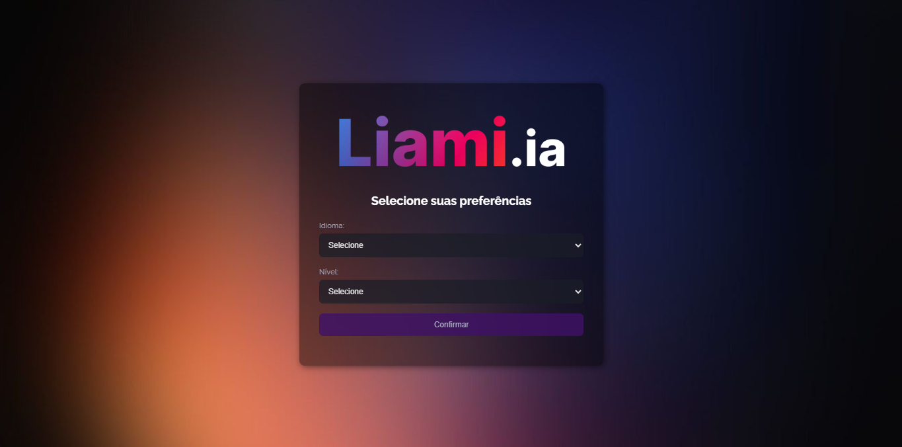
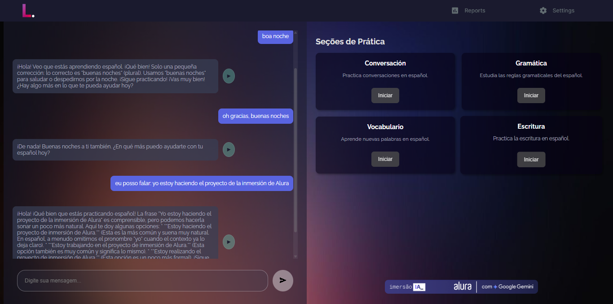

# Liami - Seu Tutor de Idiomas com Gemini

## Descrição do Projeto

A ideia por trás do Liami surgiu da minha própria experiência como estrangeiro recém-chegado ao Brasil. Ao me deparar com a barreira do idioma português, senti a falta de uma ferramenta de aprendizado que fosse verdadeiramente interativa, personalizada e acessível. Foi dessa necessidade que nasceu o Liami.

Este projeto é uma aplicação web inovadora projetada para auxiliar no aprendizado de idiomas de forma engajadora e adaptada às necessidades individuais. Utilizando a poderosa API do Gemini (Google AI), o Liami oferece conversas inteligentes, explicações gramaticais, prática de vocabulário e muito mais, tudo ajustado ao seu nível e ao idioma que você deseja aprender.

## Funcionalidades Principais

* **Seleção de Idioma e Nível:** Escolha entre inglês, espanhol, português e italiano, e defina seu nível de estudo.

* **Cronograma de Estudos:** Um cronograma visual com seções para conversação, gramática, vocabulário e escrita.
* **Prática de Gramática:** Seção dedicada com explicações e exercícios interativos (atualmente com exemplos estáticos).
* **Chat Interativo com IA:** Converse com o Liami no idioma de aprendizado e receba respostas inteligentes e relevantes, com quebras de linha formatadas para melhor leitura.

* **Síntese de Voz:** Ouça as mensagens do Liami no idioma selecionado para aprimorar a compreensão auditiva e a pronúncia.
* **Reconhecimento de Voz (Implementado):** Fale com o Liami e veja suas palavras serem transcritas para interagir no chat.
* **Cartão Informativo do Cronograma:** Uma visão geral do seu idioma e nível de estudo diretamente no cronograma.

## Tecnologias Utilizadas

* **JavaScript:** Linguagem de programação principal para a lógica da aplicação no front-end.
* **HTML:** Estrutura da página web.
* **CSS:** Estilização da interface do usuário.
* **API Gemini (Google AI):** Para o processamento de linguagem natural e geração de respostas inteligentes.
* **API Web Speech (SpeechSynthesis e webkitSpeechRecognition):** Para funcionalidades de síntese e reconhecimento de voz no navegador.

## Próximos Passos (Roadmap)

* Implementação de conteúdo dinâmico e exercícios interativos para todas as seções do cronograma (Conversação, Vocabulário, Escrita).
* Personalização do cronograma de estudos com base no progresso do usuário.
* Integração com outros recursos de aprendizado de idiomas.
* Melhorias na interface do usuário e experiência do usuário.
* Suporte para mais idiomas.

## Contribuição

Contribuições são bem-vindas! Se você tiver ideias para melhorias, correções de bugs ou novas funcionalidades, sinta-se à vontade para abrir uma issue ou enviar um pull request.

## Agradecimentos

Agradeço imensamente à Alura e ao Google Gemini pela iniciativa e pelo conhecimento transmitido. Já havia idealizado um projeto como este, e a oportunidade me proporcionou uma primeira experiência prática de desenvolvimento. Apesar de não ter conseguido finalizar o Liami nesta etapa, o aprendizado adquirido foi fundamental, e pretendo continuar estudando e desenvolvendo o projeto.
